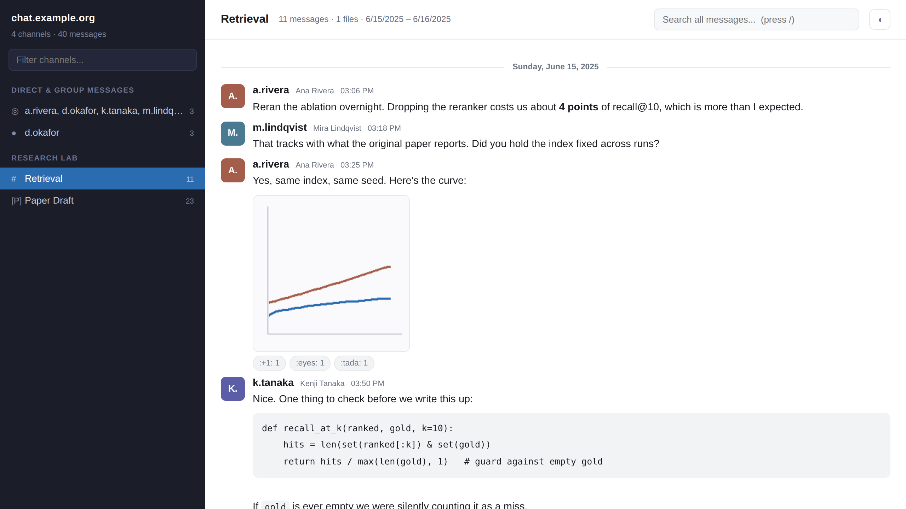
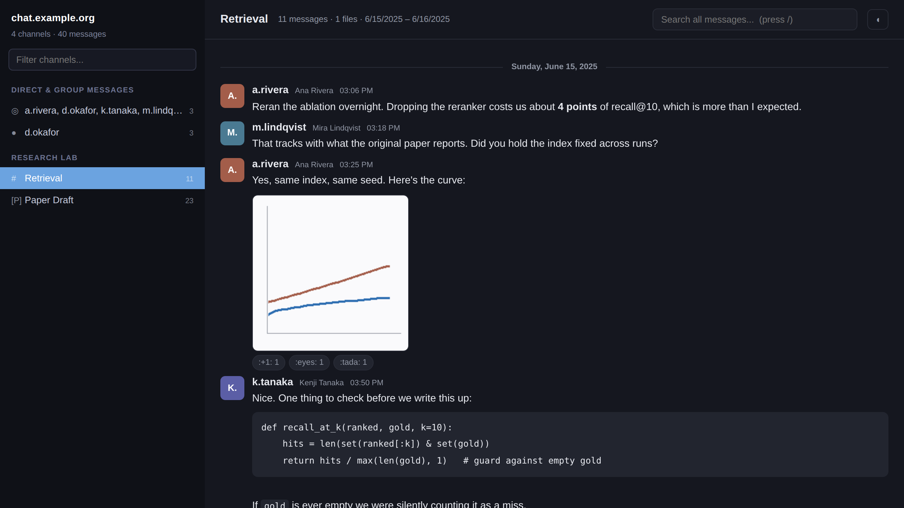

# mm-takeout

Get your Mattermost data out, and actually read it.

Export everything you can see in Mattermost — channels, DMs, threads, reactions,
attachments — and turn it into something you can actually read: a self-contained
HTML archive, or a local Mattermost you can click around in.

Built because Mattermost's own bulk export is admin-only. If you're a regular
user who wants your own data out, the REST API is the only door, and what comes
back is raw JSON that nobody wants to read.



*Screenshots use synthetic data generated by `docs/make_demo.py` — no real messages.*

## What you get

| | |
|---|---|
| **Raw JSON** | Unmodified API v4 post objects, one directory per channel. Nothing reshaped, nothing dropped. |
| **HTML viewer** | One file, no server. Channel sidebar, nested threads, inline images, full-text search across every message. |
| **Local Mattermost** | Optional. Imports the archive into a real Mattermost in Docker. |

Everything runs locally. Nothing is uploaded anywhere.

## Requirements

- Python 3.8+ (standard library only — no `pip install`)
- Docker, only if you want the local-Mattermost route
- Network access to your Mattermost server

## Quickstart

```bash
git clone https://github.com/niMgnoeSeeL/mm-takeout
cd mm-takeout
./archive.sh
```

It asks for your server URL and a token, shows you what it found, and writes
everything to `./export`. Then open `export/index.html`.

To look before you leap:

```bash
./archive.sh list        # your teams and channels, with message counts
./archive.sh messages    # messages only, skip the slow attachment download
```

Subcommands: `list`, `messages`, `attachments`, `viewer`, or no argument for the
full run. Configuration can go in `.env` (see `.env.example`) instead of prompts.

## Authentication

**Personal access token** — Profile → Security → Personal Access Tokens.
Best option, doesn't expire on logout.

**Session cookie** — if that section is missing from your profile, your admin
hasn't enabled personal access tokens, and this is the workaround. In Chrome:
DevTools (`F12` / `⌘⌥I`) → Application → Cookies → your server → copy the value
of `MMAUTHTOKEN`. It works as a bearer token and dies when you log out.

Either way you only ever get what your account can already see. This is not a
privilege escalation tool. **Revoke the token when you're done** — for a session
cookie, Profile → Security → View and Log Out of Active Sessions.

## Reading the archive

Open `export/index.html`. It reads a single `data.js` (about 250 KB per 1,000
messages) and pulls attachments from `export/channels/<channel>/files/`.

- Channels grouped by team; type to filter
- Replies nested under their parent post
- `/` focuses global search; click a result to jump to it in context
- Images inline and clickable; other attachments are download links
- Link previews, quoted permalinks, reactions, edited/pinned markers
- `◐` toggles dark mode

Keep `index.html`, `data.js`, and `channels/` together or images break.



## Verifying the archive

An archive you can't trust is worse than no archive:

```bash
python3 mmarchive/verify.py ./export
```

Checks every post the manifest claims, every attachment's presence and exact
byte size, and reply-to-parent links. Exits non-zero if anything is off.

Expect it to report a **count difference** on some channels: the server's
`total_msg_count` includes deleted posts and join/leave events that the API
won't serve. A shortfall there is normal. A missing or wrong-sized attachment
is not.

## Option B: browse it in a real Mattermost

```bash
./import-to-mattermost.sh
```

Converts the archive to Mattermost's bulk-import format, starts Mattermost +
Postgres in Docker, imports, and prints your login. Teams, channels, threaded
replies, reactions, DMs, group DMs, and attachments all come across.

```
Open       http://localhost:8065
Username   <your username>
Password   Archive-2026!    (override with MM_IMPORT_PASSWORD)
```

Your account is imported as a system admin so every channel is visible. Everyone
else gets a random password, so no one else's account can be logged into.

```bash
cd mattermost-server
docker compose stop      # shut down, keep data
docker compose start     # resume
docker compose down -v   # delete the server and all imported data
```

### What the importer can't represent

- **Self-DMs** ("notes to self") become a private channel named `self-notes`.
  Mattermost rejects a one-member direct channel outright:
  `BulkImport: Direct post channel members list contains too few items`.
- **Join/leave system messages** are dropped. The format has no place for them.
- **Bot and webhook posts** are attributed to an `archive-bot` account, with the
  original display name preserved inline in the message text.
- **Channel message counters read 0** in the UI. Bulk import doesn't update that
  counter; the messages are all there.
- Only people who actually posted or reacted get accounts. Importing every
  member of a big public channel would create thousands of empty users.

## Things that will bite you

Collected the hard way. Each of these cost real debugging time.

**Attachments silently vanish on import.** The job reports `success` and
imports zero files. Mattermost prepends `data/` to every attachment path itself,
so if your JSONL says `data/foo.png` it looks for `data/data/foo.png`, finds
nothing, and says nothing. Files go in the zip at `data/<rel>`; the JSONL must
reference bare `<rel>`. There is no error message for getting this wrong.

**`--bypass-upload` needs an absolute path.** `mmctl import process
--bypass-upload archive.zip` fails with "file doesn't exist" even when
`mmctl import list available` lists that exact filename. Pass
`/mattermost/data/import/archive.zip`.

**The Mattermost image has no shell.** `docker exec ... mkdir` or `sh -c` fails
with `executable file not found`. To create the import directory, mount the
named volume into a throwaway `alpine` container.

**No arm64 image exists.** Not for any tag — team edition or enterprise, 10.x or
11.x. On Apple Silicon it must run under emulation (`platform: linux/amd64`),
which works but is slow.

**Bind-mounted volumes fail as non-root.** The container runs as uid 2000 and
can't write to host-owned directories: `could not create config file:
permission denied`. The compose file uses named volumes to sidestep this.

**Pagination by page number gets unreliable on long channels.** The exporter
cursor-paginates with `before=<oldest post id on this page>`, which is exclusive
and can't skip or duplicate.

## Case study: a real run

Against a self-hosted Mattermost 11.7 at a research institute, from one ordinary
user account across three teams:

| | |
|---|---|
| Channels | 57 — 9 private, 9 public, 25 DMs, 14 group DMs |
| Messages | 27,121, spanning 2020-08 to 2026-08 |
| Attachments | 1,806 files, 1.90 GB |
| Participants | 191 of 3,122 total users actually posted |
| JSON size | 50 MB raw, 6.9 MB compacted for the viewer |
| Time | ~7 min for messages, ~4 min for attachments at 8 MB/s |

Personal access tokens were disabled server-side, so the whole thing ran on a
`MMAUTHTOKEN` session cookie. Attachments dominate: 1,443 files under 1 MB made
up only 13% of the bytes, while 27 files over 10 MB made up 37%.

## Is it tested?

Yes — end to end, from a clean `git clone`, against a real Mattermost 11.7.9 in
Docker seeded with public and private channels, a DM, threads, reactions,
markdown-heavy posts, and attachments. The test asserts that the export
round-trips: every message and attachment comes back byte-identical, the viewer
renders threads/images/reactions with no JS errors, and the bulk import lands
teams, channels, DMs, threads, reactions and files in a fresh server.

## How it fits together

```
archive.sh                    interactive wrapper around the four steps
mmarchive/
  export.py                   REST API -> raw JSON, one dir per channel
  fetch_files.py              parallel attachment downloader (resumable)
  build_viewer.py             raw JSON -> compact data.js + viewer
  verify.py                   completeness and integrity check
  to_bulk_import.py           raw JSON -> Mattermost bulk-import zip
viewer/index.html             the viewer (vanilla JS, no build step, no deps)
mattermost-server/            docker compose for the local Mattermost
import-to-mattermost.sh       build zip -> start server -> import -> report
```

Each script is standalone and takes the export directory as its argument, so you
can run any step on its own or swap one out.

Every step is resumable. `export.py` and `fetch_files.py` skip what they already
have, so an interrupted run is fixed by running it again.

## Using it as a data source

`export/channels/<channel>/posts.jsonl` is one JSON object per line, oldest
first — convenient for streaming or `grep`:

```bash
# every message mentioning a term, with its author id
grep -h "deadline" export/channels/*/posts.jsonl \
  | python3 -c "import sys,json;[print(json.loads(l)['user_id'], json.loads(l)['message'][:80]) for l in sys.stdin]"
```

`export/users_by_id.json` maps user ids to usernames.
`export/export_manifest.json` has per-channel counts and date ranges.

## Limitations

- Only exports what your account can see. Channels you're not in are invisible.
- Deleted posts are not recoverable; the API doesn't serve them.
- Custom emoji are exported by name, not as images.
- Threads with a deleted root show replies at top level.
- The viewer loads all messages into memory. Fine at 27k; if you have millions,
  use the JSONL directly.

## License

MIT — see [LICENSE](LICENSE).

An independent project. Not affiliated with, sponsored by, or endorsed by
Mattermost, Inc. "Mattermost" is a trademark of Mattermost, Inc. and is used
here only to describe what this tool interoperates with.
